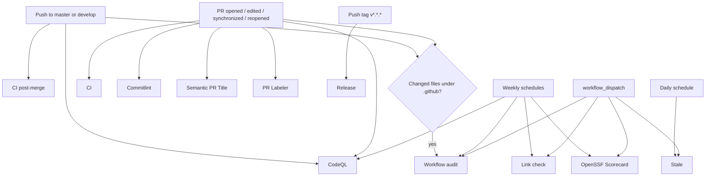

# GitHub Actions workflow flow

This document describes the workflows currently defined in
`.github/workflows/`. All jobs run on GitHub-hosted `ubuntu-latest` runners.
PHP-related commands run through the repository Docker Compose setup
(`tools/ci/docker-compose`).

## Overall event flow

## CI gate

The primary `ci.yml` runs on every pull request into `master` or `develop`
with a dependency-ordered chain:

1. `Validate` — builds the PHP image, installs dependencies, `composer validate --strict`
2. `Lint (Pint / PHPCS / PHPStan / PHPMD / PHP-CS-Fixer)` — full lint matrix
3. `Security (Dependencies / Secrets / SAST)` — composer audit, OSV, dependency
   review, Gitleaks, Semgrep
4. `Test (Unit / Feature)` — PHPUnit with per-suite Clover coverage
5. `Coverage upload` — enforces the 85% per-suite floor and merges the Clover
   reports; this job `needs` the whole chain, so it is the merge-blocking gate.

`ci-post-merge.yml` runs the same validate / test / coverage chain on the
`master` and `develop` heads after merge.